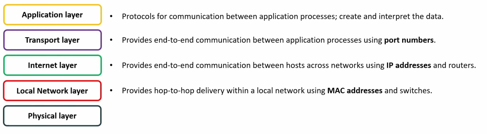
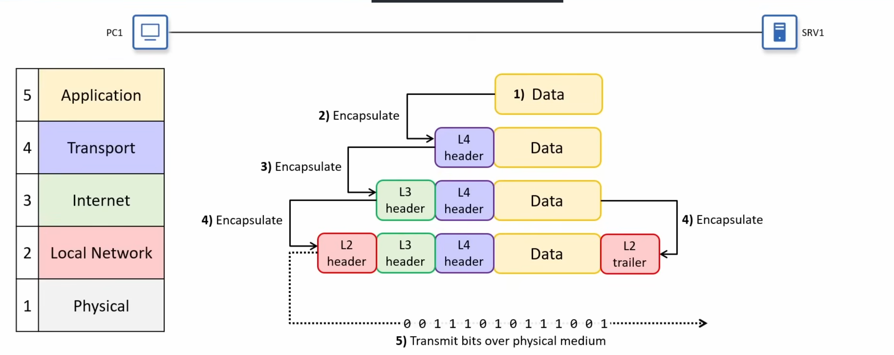

***This project has been created as part
of the 42 curriculum by `sboukiou`.***

# Description:
```
    This project is about managaing and configuring templates pre-defined
    small networks using subnetting skills and (Tcp/IP) addressing
```

# Instructions:

```bash
    # To get started with the project you need to have its appropriate resources
    # available on the project page in the intranet
    # * Open a file manager and double-click the index.html file
    # * or:
        cd ./assets/
        python3 -m http.server
        # and then go to a web browser and type: localhost:<port-number-given-in-the-output>
        # (The port is usually 8000)
```

# Resources:
\
    **Here are some of the resources that can serve as a\
    reference and are related to the project (And networking in general)**\
**[How the TCP/IP Model works](https://youtu.be/yM-XNq9ADlI?si=uRzuVTD-lsaaoz4f)**\


**[What is the OSI Model ?](https://www.cloudflare.com/learning/ddos/glossary/open-systems-interconnection-model-osi/)**


**[Data Encapsulation/Decapsulation](https://docs.oracle.com/cd/E19455-01/806-0916/ipov-32/index.html)**\

